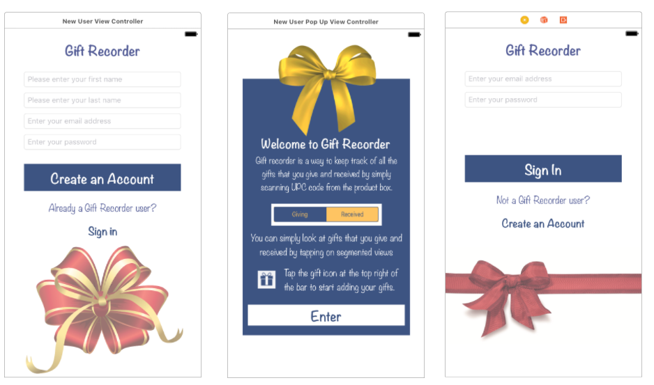
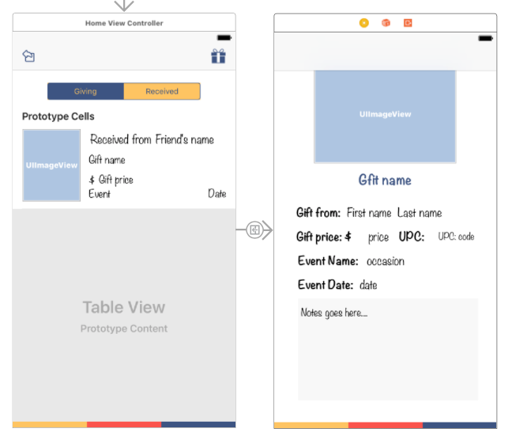
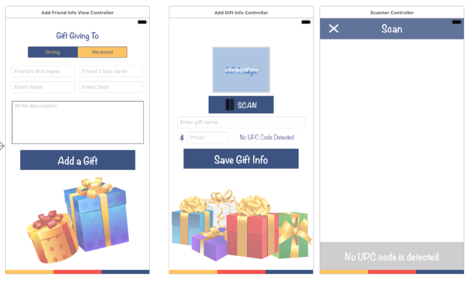

#Project 4 for iOS Immersive
##Project Name: Gift Recorder (Gift Tracker)
Gift Recorder is a way to keep record of all the gifts that you give and received by simply using your phone's camera feature to scan UPC code on the gift/product box.  With the UPC code that was obtained, Gift Recorder utilizes [UPCItemdb API](http://www.upcitemdb.com/) to match up with the gift names, prices and product images to keep a record of it.  By having this information easily available in one single app, an user can simply refer this collection of information for future usage.

In order to start using Gift Recorder, you have to create an account so that your gift lists are for your eyes only.  

Account information and collection of gift lists are stored in [Firebase Database](https://firebase.google.com/). 

Gift Recorder is best used with iPhone 6 and above.
Gift Recorder requires to be connected via wifi or internet to retrieve information from Firebase.

* Architected Firebase Model
* Integrated scanner code to customize GiftTracker App
* Used RESTful API and jSON serialization to obtain data from UPC Item Database
* Used Firebase Database to store gift information
* Used Firebase Auth for authentication of users to keep the gift information private

##Research Plan
[Link to Research Plan](research.md)

##Proposal
[Link to Propsal](proposal.md)

##Future Implementation
* Search functionality
* Setting page to change password, email address or delete an account
* Able upload your own photo of gift
* Able to modify gift information

##Login, Create New Account and Welcome modal

##All Received & Giving Gifts and Gift Detail

##Add Friend's info, Gift ino and Scanner
