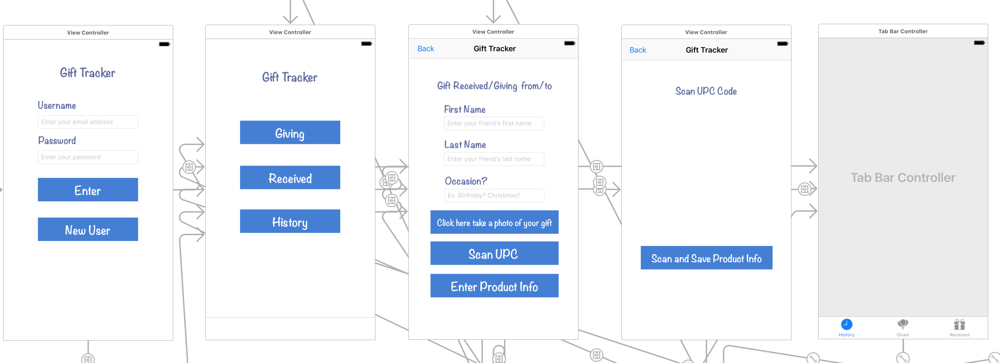
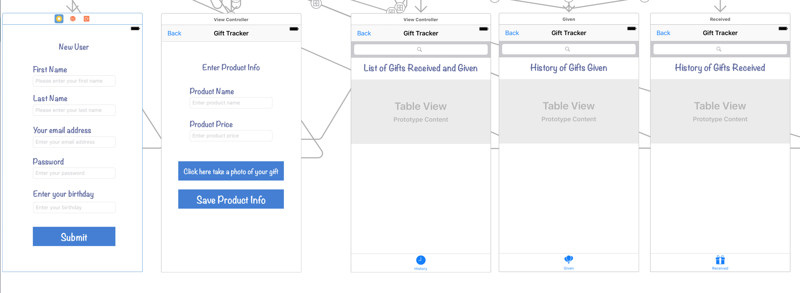

# Research Plan

**Title:** Gift tracker app field study  
**Author:** Grace Yu  
**Date:** 1/30/2017  
**Background:** I have a child who gets invited to lots of birthday parties. We spend decent amount of money to buy for my son's friend's birthday gifts.  But when my son had his birthday, we recieved many gifts that were way below what we got for particular child's birthday.  So, I started to track what we give out and what we recieved. Having this app will help me maintain a good history.   
**Goal:** To develop a great user experience   
**Resarch questions:**   
* How many gifts do you buy per year?  
* How many gifts did you receive this year?  
* Do you remember what you got for a person 3 years ago?  
* Do you keep track of what gifts you gave out?  
* Do you use any app to keep track of something?  
**Methodology:** Doing this research to find what the users want from this app.  
**Participants:** Target audience will be singles, couples and people who have children whom gets invited to various parties who are budget concious, who needs organization, who wants to keep track of gift received and give out.  
**Schedule:** TBD  
**Script:**   
* Device: What device do you use?     
* Budget: Are you conscious about what to get for a person?  
* Product: What is the most memorable gift that you got?  
* Regifting: Have you thought about regifting?  
* APP: What is your favorite APP and why?  

## Competitive research 

What They Do Well          | What They Do Poorly           | How We Could Improve     |
---------------------------|-------------------------------|--------------------------|
Hallmark knows how to celebrate life stages. | They don't keep track of gift giving. | Make a better experience for user to track what they give out and what they receive.|

## User Personas and User Stories
    
**Sketch Them, Add Bio & Demographic Details:**  
* Single  
* Married    
* Family
* Demographic: 20~70 years old both female/male who lives in US
* Money conscious  
* Gets invited to various parties through out the year and have hard time tracking what she gave to whom.  
* Gets lots of gifts from her families and friends but having a hard time keeping track of what she got.

**Behaviors & Habits:**  
* An easy way to record gift that was given and/or recieved.  

**Stoires, scenarios & frustrations:**  
* Thrifty Terri wants to know what she got for her friend 2 years ago and wants to know how much she spent on the gift.  
* Thrifty Terri wants to know how much she spent on gifts this month since she went to 6 different parties.  
* Thrifty Terri wants to know how much her friend Kelly paid for her birthday gift last year, so that she doesn't spend anything less than what Kelly paid for her birthday gift.  
* Thrifty Terri wants to able to record her gift giving very easily  
* Thrifty Terri wants to able to record gifts that she received very easily  
* Thrifty Terri is tired of keeping track her gift giving and gift receiving on her computer  
* Thrifty Terri wants an easier way to keep track of her gift givin and gift receiving on her mobile device

**Needs/ Problems/ Goals:**  
* With her fast pace liftstyle she needs single and an easy to get to gift tracking app

**Name: Thrifty Terri**  
**Age: 32**  
**Married with 2 Children**  
**Thrifty Terri and her husband works full time**  

## Research Highlights
**Observations (What did you see or hear? Memorable quotes? Did they say/do anything surprising?):**  
* This could possibility used for bridal showers or baby showers where recording keeping of gift recieved is essential for the new bride or new moms. It will be less hassle and more cleaner way for the new brides or new moms to read the what they got from whom.

**Insights (Major themes or learning form the observations):**  
* Original intention for this APP was tracking birthday gifts but this can potentially be used in all different life moments for potential users.

**Design Recommendations (How do these insights apply to the designs):**  
* Instead of being more specific to just birthdays, it needs to be more generic so that it can cater towards all sorts of life events.

**Were there any new topics or open quesitons to research further?:**  
* No 

## Prioritized features
1. Ability to save user's information on Firebase
2. Ability to retrieve user's information from Firebase
3. Auth on the APP
4. Ability to scan UPC code and grab product's name and price (if that's possible)
5. Ability to search database to do search by name
6. Ability to take a photo of the product and save information
7. Use data persistance when it's offline
8. Sync data with Firebase when APP is able to connect to Firebase

## Wireframes

